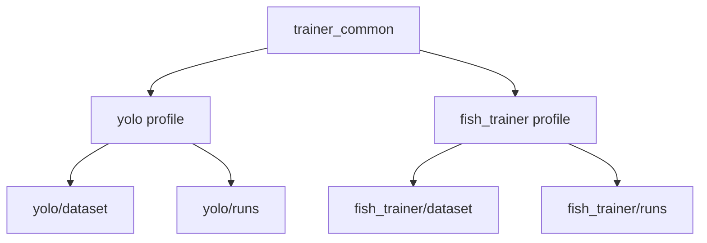

[简体中文](README.zh-CN.md) | [English](README.en-US.md) | [日本語](README.ja-JP.md)

# VRChat Auto Fishing Assistant (FISH!)

An auto-fishing script for the VRChat world **FISH!**. It supports YOLO object detection and a PD controller to automate casting, hooking, and the fishing mini-game.

## Features

- **Automatic casting / hooking**: Detects bite animations and completes the fishing loop automatically
- **Mini-game automation**: Uses a PD controller to track the fish position and control the white bar
- **YOLO object detection**: Can replace template matching after training for higher accuracy
- **GUI**: Visual parameter tuning with a real-time debug window
- **Hotkeys**: `F9` start/pause, `F10` stop, `F11` debug mode
- **VRChat OSC input**: Optional OSC-based input so the mouse is not occupied

## Quick Start

### Option 1: One-click launch (recommended)

1. Install [Python 3.10+](https://www.python.org/downloads/) and enable **Add to PATH**
2. Double-click `启动.bat`; dependencies are installed automatically on first run, then the app starts directly afterward

> GPU detection is automatic: NVIDIA installs the CUDA build, AMD / Intel installs the CPU build.

### Option 2: Manual installation

```bash
# Install PyTorch (GPU build)
pip install torch torchvision --index-url https://download.pytorch.org/whl/cu128

# Or CPU build
pip install torch torchvision --index-url https://download.pytorch.org/whl/cpu

# Install remaining dependencies
pip install -r requirements.txt

# Start
python main.py
```

## Usage

1. Launch VRChat and enter the `FISH!` world
2. Run the program and click "Select Window" to bind the VRChat window
3. Click "Select Region" to define the fishing mini-game detection area if needed
4. Press `F9` to start auto fishing

## Hotkeys

| Key | Function |
| --- | --- |
| `F9` | Start / pause |
| `F10` | Stop |
| `F11` | Debug mode (show detection window) |

## Project Structure

```text
├── main.py              # Entry point
├── config.py            # Global configuration
├── core/                # Core logic
│   ├── bot.py           # Main fishing loop + PD controller
│   ├── detector.py      # Template matching detector
│   ├── yolo_detector.py # YOLO detector
│   ├── screen.py        # Screen capture
│   ├── window.py        # Window management
│   └── input_ctrl.py    # Input control
├── gui/                 # GUI
│   └── app.py
├── utils/               # Utilities
│   └── logger.py
├── img/                 # Template images
├── yolo/                # Legacy YOLO models and training scripts
├── fish_trainer/        # Standalone multi-color fish collection / labeling / migration / training tools
├── 启动.bat            # One-click launch (install + run)
├── install.bat          # Install dependencies only
└── start.bat            # Start program only
```

## Training And Labeling

This repository is no longer a simple "old scripts vs new scripts" split. It now exposes two training profiles backed by the shared `trainer_common/` implementation:

- `yolo/`: the `runtime_yolo` data pipeline used by the main app at runtime
- `fish_trainer/`: the standalone multi-color fish pipeline `multicolor`

They share collection, labeling, training, and dataset-management logic, but keep separate dataset and run directories:



### Which pipeline should I use?

- Use `yolo/` if you want to train the model actually consumed by the main app at runtime, or if you need **auto-labeling**
- Use `fish_trainer/` if you want an independent multi-color dataset workflow with GUI support, zip export, and migration from the old `yolo/dataset`

### `yolo/`: runtime model pipeline

`yolo/` is still the runtime model profile used by the main application. It is not just a deprecated legacy path. Its dataset lives under `yolo/dataset`, and training output goes to `yolo/runs`.

Common commands:

```bash
python -m yolo.collect --fps 2.0 --roi --max 200
python -m yolo.label --split 0.2
python -m yolo.label --relabel
python -m yolo.train --model yolov8n.pt --epochs 80 --imgsz 640 --batch -1
python -m yolo.train --resume
```

#### Auto-labeling

Only `yolo.label` supports auto-labeling. The most common commands are:

```bash
python -m yolo.label --predict-model yolo\runs\fish_detect\weights\best.pt
python -m yolo.label --predict-model yolo\runs\fish_detect\weights\best.pt --auto-predict
python -m yolo.label --relabel --predict-model yolo\runs\fish_detect\weights\best.pt --auto-predict
```

Key options:

- `--predict-model`: model path used for auto-labeling
- `--predict-conf`: confidence threshold for auto-labeling, default `0.25`
- `--predict-device`: inference device, supports `auto/cpu/cuda`
- `--auto-predict`: run prediction automatically when an image is opened
- `--multi-per-class`: allow multiple boxes per class; by default only the highest-confidence box per class is kept

Notes:

- `--auto-predict` must be used together with `--predict-model`
- Press `A` inside the labeler to auto-label the current image once
- `yolo.label` supports right-click box selection, left-drag overwrite, `J` for previous image, `Ctrl+D` to delete the current image, `[` / `]` to resize the selected box, and `,` `.` `;` `'` for box nudging
- The current `yolo` labeler includes runtime-specific classes such as `progress`, `prog_hook`, and the newly appended `fish_teal` on key `0`

### `fish_trainer/`: standalone multi-color pipeline

`fish_trainer/` is the other profile on top of the same shared training framework. Its dataset lives under `fish_trainer/dataset`, and training output goes to `fish_trainer/runs`. It is better suited for independent collection, migration, GUI-based workflows, and exporting labeled data.

Entry commands:

```bash
python -m fish_trainer.collect --fps 2.0 --roi --max 200
python -m fish_trainer.label --split 0.2
python -m fish_trainer.label --relabel
python -m fish_trainer.migrate_labels --with-unlabeled
python -m fish_trainer.train --model yolov8n.pt --epochs 80 --imgsz 640 --batch -1
python -m fish_trainer.train --resume
python -m fish_trainer.gui
```

For class definitions, hotkeys, migration details, and GUI usage, see [`fish_trainer/README.en-US.md`](fish_trainer/README.en-US.md).

### Current class caveat

- The labelers already support `fish_teal`
- `yolo.label` also supports `prog_hook`
- Training YAML files may not yet declare every newly added labeling class; this documentation describes the current tool behavior and does not overstate training-yaml coverage

## Patch Updates

If you use the EXE build, download the patch zip, extract it next to the EXE, and make sure a `patch/` folder is created. The program will load the patch automatically on startup.

The release asset is a single universal package. If a usable NVIDIA CUDA environment is detected, the app will prefer GPU execution; otherwise it will automatically fall back to CPU without requiring a separate download.

## GitHub Actions

- `.github/workflows/test.yml`: runs lightweight Windows checks on `push` and `pull_request`
- `.github/workflows/release-build.yml`: manually builds the CUDA package and uploads a `7z` asset to the target GitHub Release

## License

MIT
