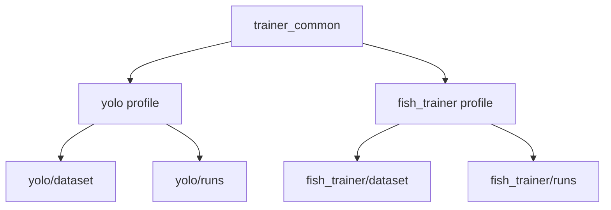

[简体中文](README.zh-CN.md) | [English](README.en-US.md) | [日本語](README.ja-JP.md)

# VRChat 自動釣りアシスタント (FISH!)

VRChat ワールド **FISH!** 向けの自動釣りスクリプトです。YOLO 物体検出と PD コントローラに対応し、キャスト、フッキング、ミニゲーム操作を自動化できます。

## 機能

- **自動キャスト / 自動フッキング**: 食いつきアニメーションを検出して釣りの一連の流れを自動実行
- **ミニゲーム自動操作**: PD コントローラで魚の位置を追跡し、白いバーを自動制御
- **YOLO 物体検出**: 学習後はテンプレートマッチングの代わりに利用でき、精度を向上
- **GUI**: パラメータを視覚的に調整でき、リアルタイムのデバッグウィンドウも利用可能
- **ホットキー操作**: `F9` で開始/一時停止、`F10` で停止、`F11` でデバッグモード
- **VRChat OSC 入力**: マウスを占有しない任意の OSC 入力方式に対応

## クイックスタート

### 方法1: ワンクリック起動（推奨）

1. [Python 3.10+](https://www.python.org/downloads/) をインストールし、**Add to PATH** を有効にする
2. `启动.bat` をダブルクリックする。初回のみ依存関係を自動インストールし、その後は直接起動される

> GPU は自動判定されます。NVIDIA では CUDA 版、AMD / Intel では CPU 版がインストールされます。

### 方法2: 手動インストール

```bash
# PyTorch をインストール（GPU 版）
pip install torch torchvision --index-url https://download.pytorch.org/whl/cu128

# または CPU 版
pip install torch torchvision --index-url https://download.pytorch.org/whl/cpu

# そのほかの依存関係をインストール
pip install -r requirements.txt

# 起動
python main.py
```

## 使い方

1. VRChat を起動して `FISH!` ワールドに入る
2. プログラムを起動し、「选择窗口」をクリックして VRChat ウィンドウを関連付ける
3. 必要に応じて「框选区域」をクリックし、釣りミニゲームの検出範囲を指定する
4. `F9` を押して自動釣りを開始する

## ホットキー

| キー | 機能 |
| --- | --- |
| `F9` | 開始 / 一時停止 |
| `F10` | 停止 |
| `F11` | デバッグモード（検出ウィンドウを表示） |

## プロジェクト構成

```text
├── main.py              # エントリーポイント
├── config.py            # グローバル設定
├── core/                # コアロジック
│   ├── bot.py           # 釣りメインループ + PD コントローラ
│   ├── detector.py      # テンプレートマッチング検出
│   ├── yolo_detector.py # YOLO 検出
│   ├── screen.py        # 画面キャプチャ
│   ├── window.py        # ウィンドウ管理
│   └── input_ctrl.py    # 入力制御
├── gui/                 # GUI
│   └── app.py
├── utils/               # ユーティリティ
│   └── logger.py
├── img/                 # テンプレート画像
├── yolo/                # 旧 YOLO モデルと学習スクリプト
├── fish_trainer/        # 独立した多色魚の収集 / ラベル付け / 移行 / 学習ツール
├── 启动.bat            # ワンクリック起動（インストール + 実行）
├── install.bat          # 依存関係のみインストール
└── start.bat            # プログラムのみ起動
```

## 学習とラベル付け

このリポジトリは、もはや単純な「旧スクリプト / 新スクリプト」の構成ではありません。共有実装 `trainer_common/` の上に、2 つの学習 profile が存在します。

- `yolo/`: メインアプリが実行時に使う `runtime_yolo` データパイプライン
- `fish_trainer/`: 独立した多色魚データパイプライン `multicolor`

両者は収集、ラベル付け、学習、データセット管理のロジックを共有していますが、データセットと学習出力ディレクトリは分かれています。



### どちらを使うべきか

- メインアプリが実際に使う実行時モデルを学習したい、または**自動打標**を使いたい場合は `yolo/`
- GUI、zip 出力、旧 `yolo/dataset` からの移行を含む独立した多色魚ワークフローを使いたい場合は `fish_trainer/`

### `yolo/`: 実行時モデルパイプライン

`yolo/` は今でもメインアプリが使う実行時モデル profile であり、廃止済みの旧経路ではありません。データセットは `yolo/dataset`、学習出力は `yolo/runs` に保存されます。

よく使うコマンド:

```bash
python -m yolo.collect --fps 2.0 --roi --max 200
python -m yolo.label --split 0.2
python -m yolo.label --relabel
python -m yolo.train --model yolov8n.pt --epochs 80 --imgsz 640 --batch -1
python -m yolo.train --resume
```

#### 自動打標

自動打標に対応しているのは `yolo.label` だけです。よく使うコマンドは次の通りです。

```bash
python -m yolo.label --predict-model yolo\runs\fish_detect\weights\best.pt
python -m yolo.label --predict-model yolo\runs\fish_detect\weights\best.pt --auto-predict
python -m yolo.label --relabel --predict-model yolo\runs\fish_detect\weights\best.pt --auto-predict
```

主なオプション:

- `--predict-model`: 自動打標に使うモデルパス
- `--predict-conf`: 自動打標の信頼度しきい値。既定値は `0.25`
- `--predict-device`: 推論デバイス。`auto/cpu/cuda` を指定可能
- `--auto-predict`: 画像を開いたときに自動で予測を実行
- `--multi-per-class`: 同一クラスの複数ボックスを許可。既定では各クラスの最高信頼度ボックスのみ保持

補足:

- `--auto-predict` は `--predict-model` と一緒に使う必要があります
- ラベラー内で `A` を押すと、現在の画像に対して 1 回だけ自動打標できます
- `yolo.label` は右クリック選択、左ドラッグ上書き、`J` で前画像、`Ctrl+D` で現在画像削除、`[` / `]` で選択ボックス拡縮、`,` `.` `;` `'` で微調整に対応しています
- 現在の `yolo` ラベラーには `progress`、`prog_hook`、そしてキー `0` に割り当てられた新しい `fish_teal` が含まれます

### `fish_trainer/`: 独立多色魚パイプライン

`fish_trainer/` は同じ共有学習フレームワーク上のもう一つの profile です。データセットは `fish_trainer/dataset`、学習出力は `fish_trainer/runs` に保存されます。独立した収集、旧データ移行、GUI ベースの運用、ラベル済みデータの出力に向いています。

入口コマンド:

```bash
python -m fish_trainer.collect --fps 2.0 --roi --max 200
python -m fish_trainer.label --split 0.2
python -m fish_trainer.label --relabel
python -m fish_trainer.migrate_labels --with-unlabeled
python -m fish_trainer.train --model yolov8n.pt --epochs 80 --imgsz 640 --batch -1
python -m fish_trainer.train --resume
python -m fish_trainer.gui
```

クラス定義、ショートカット、移行詳細、GUI の使い方は [`fish_trainer/README.ja-JP.md`](fish_trainer/README.ja-JP.md) を参照してください。

### 現在のクラスに関する注意

- ラベラーはすでに `fish_teal` をサポートしています
- `yolo.label` はさらに `prog_hook` もサポートしています
- 学習 YAML が新しく追加された全ラベルクラスをまだ宣言していない可能性があるため、この README では現在のツール挙動を記述し、学習 YAML 側の完全同期までは断定しません

## パッチ更新

EXE 版を使う場合は、パッチ zip をダウンロードして EXE と同じ階層に展開し、`patch/` フォルダが生成されていることを確認してください。起動時に自動で読み込まれます。

配布アセットは単一の共通パッケージです。利用可能な NVIDIA CUDA 環境が検出された場合は GPU を優先し、利用できない場合は別パッケージを用意しなくても自動で CPU にフォールバックします。

## GitHub Actions

- `.github/workflows/test.yml`: `push` / `pull_request` 時に Windows の軽量チェックを実行します
- `.github/workflows/release-build.yml`: 手動で CUDA パッケージをビルドし、対象 GitHub Release に `7z` アセットをアップロードします

## License

MIT
